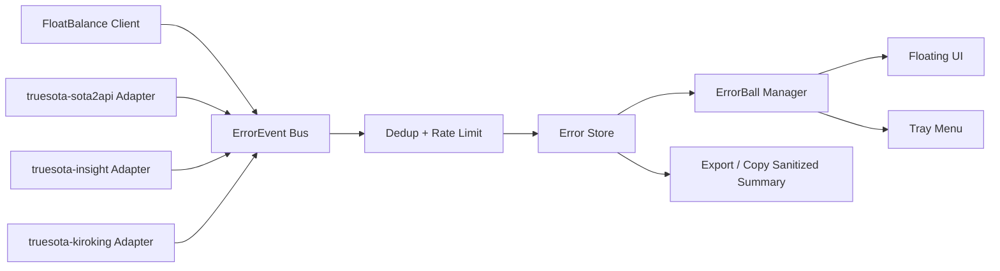

# FloatBalance ErrorBall 技术文档

版本：v0.1  
日期：2026-08-20  
状态：草案，可进入原型实现  

## 1. 目标

ErrorBall 是 FloatBalance 的统一错误可视化层。它把客户端、代理服务和 TrueSOTA 相关服务中的关键错误，归一化成桌面悬浮球状态，让用户不用翻日志也能知道哪里出问题。

首批计划接入的仓库：

| 仓库 | 语言 | 预期角色 |
|---|---|---|
| `truesota-sota2api` | Go | API 中转 / 代理服务，重点关注 HTTP、上游、鉴权、限流错误 |
| `truesota-insight` | Python | 视图 / 数据服务，重点关注接口异常、报表/任务失败、数据缺失 |
| `truesota-kiroking` | Python | 自动化 / 调度类服务，重点关注任务失败、外部调用失败、脚本异常 |

说明：本轮克隆仓库被审批层拦截，本文先定义稳定的接入契约。仓库可访问后，应补充每个服务的实际日志字段、health endpoint 和错误枚举。

## 2. 总体架构



核心原则：

- 各错误源只负责产出 `ErrorEvent`
- 去重、合并、静音、恢复态由客户端统一处理
- UI 不直接消费原始日志
- 任何展示/复制给用户的内容必须先脱敏

## 3. ErrorEvent 标准模型

```ts
type ErrorSeverity = "info" | "warn" | "error" | "critical";
type ErrorStatus = "active" | "recovering" | "resolved" | "muted" | "acknowledged";
type ErrorCategory =
  | "network"
  | "auth"
  | "quota"
  | "rate_limit"
  | "upstream"
  | "validation"
  | "runtime"
  | "deploy"
  | "config"
  | "unknown";

interface ErrorEvent {
  id: string;
  fingerprint: string;
  source: "client" | "truesota" | "sota2api" | "insight" | "kiroking" | "deepseek" | "sub2" | "proxy";
  repo?: "truesota-sota2api" | "truesota-insight" | "truesota-kiroking";
  service?: string;
  category: ErrorCategory;
  severity: ErrorSeverity;
  status: ErrorStatus;
  title: string;
  message: string;
  sanitizedMessage: string;
  rawMessageHash?: string;
  endpoint?: string;
  httpStatus?: number;
  traceId?: string;
  taskId?: string;
  accountRef?: string;
  firstSeenAt: number;
  lastSeenAt: number;
  count: number;
  recoverAfterSuccessCount?: number;
  link?: string;
  suggestedAction?: string;
}
```

### 3.1 指纹规则

首版指纹：

```text
fingerprint = sha256(source + category + endpoint + normalized_message)
```

归一化规则：

- 移除时间戳
- 移除 request id / trace id / uuid
- 移除 token / key / Authorization / Cookie
- 将数字 ID 替换为 `<id>`
- 将连续空白压缩为一个空格

## 4. 错误源 Adapter

### 4.0 TrueSOTA 页面接口

从 TrueSOTA 前端只读检查得到的接口边界：

- `GET /api/v1/user/profile`：账户资料和总余额，需要显式提供 Web Bearer token。
- `GET /api/v1/usage/errors`：使用错误列表，需要显式提供 Web Bearer token。
- `GET /api/v1/usage/errors/{id}`：错误详情，需要显式提供 Web Bearer token。
- `GET /v1/usage`：历史调研记录中的单 API Key 余额探针，不作为 FloatBalance 首版余额球来源。

安全约束：

- 不读取浏览器 Cookie、localStorage、密码管理器或页面完整密钥。
- token 优先保存到系统凭据；环境变量只作为本机临时覆盖。
- 不把 token 写入配置文件或 Git。
- 所有请求失败都先归一化为 `ErrorEvent`，再进入 `ErrorStore`。

### 4.1 客户端 Adapter

来源：

- 余额接口请求失败
- Tauri 插件调用失败
- keyring 读写失败
- CSS 文件读取或净化失败
- 配置解析失败

建议实现：

```js
class ClientErrorAdapter {
  capture(error, context) {
    return normalizeErrorEvent({
      source: "client",
      category: classifyClientError(error),
      severity: inferSeverity(error, context),
      title: context.title || "客户端错误",
      message: String(error?.message || error),
      endpoint: context.endpoint,
      accountRef: context.accountRef
    });
  }
}
```

### 4.2 `truesota-sota2api` Adapter

重点错误：

| 错误 | 分类 | 级别 |
|---|---|---|
| GitHub / upstream connect timeout | network | error |
| DeepSeek / Sub2 返回 401 | auth | error |
| 上游 429 | rate_limit | warn |
| 上游 5xx | upstream | error |
| 模型不可用 / provider 不支持 | validation | error |
| 代理服务自身 panic | runtime | critical |

推荐接入方式：

- `/healthz`：服务活性
- `/metrics`：可选，暴露错误计数
- `/api/v1/errors/recent`：返回最近 N 条脱敏错误
- 本地开发模式可 tail 日志文件

### 4.3 `truesota-insight` Adapter

重点错误：

| 错误 | 分类 | 级别 |
|---|---|---|
| API 返回非 JSON | validation | error |
| 数据查询为空但页面需要展示 | validation | warn |
| 报表生成失败 | runtime | error |
| 数据库连接失败 | network | critical |
| 用户无权限 | auth | error |

推荐接入方式：

- FastAPI/Flask 全局异常处理器输出结构化错误
- 页面 API 错误统一转换为 `ErrorEvent`
- 对任务型失败暴露 `taskId` 和查看链接

### 4.4 `truesota-kiroking` Adapter

重点错误：

| 错误 | 分类 | 级别 |
|---|---|---|
| 自动化任务失败 | runtime | error |
| 外部 API 调用失败 | upstream | error |
| GitHub 操作失败 | auth / network | error |
| 本地依赖缺失 | config | warn |
| 连续失败超过阈值 | runtime | critical |

推荐接入方式：

- CLI 输出 NDJSON，每行一个结构化事件
- 日志文件 Adapter 只读 tail
- 长任务用 `taskId` 串联开始、失败、恢复

## 5. 去重、聚合与恢复

### 5.1 去重

同一 `fingerprint` 在 10 分钟内再次出现：

- 不新增错误球
- `count += 1`
- 更新 `lastSeenAt`
- 如果级别更高，提升 `severity`

### 5.2 聚合

当 active 错误数量超过 3 个：

- 只展示最高级别的 3 个独立错误球
- 其他合并为一个 `+N` 错误簇
- 点击错误簇进入错误列表

### 5.3 恢复

当某来源连续成功达到阈值：

- `active -> recovering`
- 观察 5 分钟无新错误后：`recovering -> resolved`
- resolved 错误默认 30 分钟后从主 UI 隐藏，仅保留历史

## 6. UI 行为

### 6.1 ErrorBall 视觉规则

| 状态 | 颜色 | 动画 | 说明 |
|---|---|---|---|
| warn | 黄色 | 轻微呼吸 | 降级或可恢复 |
| error | 红色 | 稳定常亮 | 当前功能失败 |
| critical | 深红 | 慢闪 | 核心功能不可用 |
| recovering | 蓝绿色 | 无 | 最近恢复，观察中 |
| acknowledged | 灰色 | 无 | 用户已确认 |

### 6.2 展开详情

错误详情需要显示：

- 来源服务
- 错误标题
- 脱敏消息
- 首次出现时间
- 最近出现时间
- 出现次数
- endpoint / traceId / taskId
- 建议动作
- 复制摘要按钮
- 静音按钮

### 6.3 复制摘要格式

```text
[FloatBalance Error]
source: sota2api
severity: error
category: upstream
endpoint: /v1/usage
count: 6
first_seen: 2026-08-20 10:01:22
last_seen: 2026-08-20 10:07:44
message: upstream returned 502: provider unavailable
trace_id: req_xxx
```

复制前必须执行脱敏，禁止包含：

- API Key
- Authorization
- Cookie
- refresh token
- access token
- 完整 URL query 中的敏感参数

## 7. 本地存储

建议使用 Tauri Store 保存非敏感错误状态：

```json
{
  "errorBalls": {
    "muteRules": [
      {
        "source": "sota2api",
        "fingerprint": "abc123",
        "until": 1787200000000
      }
    ],
    "historyRetentionHours": 72,
    "maxActiveBalls": 3
  }
}
```

原始日志不进入 store，只保存脱敏摘要和 hash。

## 8. 安全与隐私

1. Adapter 输入可以包含原始错误，但进入 UI 前必须脱敏。
2. 默认不上传错误事件。
3. 如果未来支持团队共享，必须显式开启，并展示上报字段预览。
4. 错误详情里默认展示短 token/hash，不展示完整密钥或完整 Cookie。
5. CSS 自定义不能读取错误原始内容，只能控制样式。

## 9. 首版开发任务

### 9.1 客户端

1. 新增 `error-event.js`：模型、分类、指纹、脱敏
2. 新增 `error-store.js`：错误缓存、历史、静音规则
3. 新增 `error-ball-manager.js`：UI 状态计算
4. 新增 `error-ball.css`：错误球样式
5. 将 `network-client.js` 的异常统一转 `ErrorEvent`
6. 余额请求失败时更新错误球

### 9.2 代理服务

1. 统一 Go/Python 服务错误 envelope
2. 增加 `/healthz`
3. 增加 `/api/v1/errors/recent` 或本地日志 Adapter
4. 日志脱敏
5. 为外部请求增加 trace id

### 9.3 UI

1. 主悬浮球旁展示错误角标
2. 超过 1 个错误时展示错误簇
3. 错误详情抽屉
4. 复制脱敏摘要
5. 静音 / 确认 / 恢复态

## 10. 验收用例

| 用例 | 操作 | 预期 |
|---|---|---|
| 网络超时 | 断网后刷新余额 | 5 秒内出现 network/error 错误球 |
| 鉴权失败 | 使用无效 token | 出现 auth/error，摘要不暴露 key |
| 高频重复 | 连续触发同一 502 | 只出现 1 个错误球，count 增加 |
| 恢复 | 服务恢复并连续成功 | 错误球变为 recovering，随后隐藏 |
| 静音 | 对某错误静音 30 分钟 | 期间不再强提示，仅详情列表可见 |
| 复制摘要 | 点击复制 | 内容脱敏且包含 source/category/count |

## 11. 待补源码级信息

仓库成功拉取后，需要补：

- `truesota-sota2api` 的路由、日志格式、错误 envelope
- `truesota-insight` 的 Web/API 框架、异常处理入口
- `truesota-kiroking` 的任务执行模型、日志位置、失败状态
- 是否已有 Sentry、OpenTelemetry、Prometheus 或自研监控
- 是否能提供统一 `/errors/recent` endpoint
